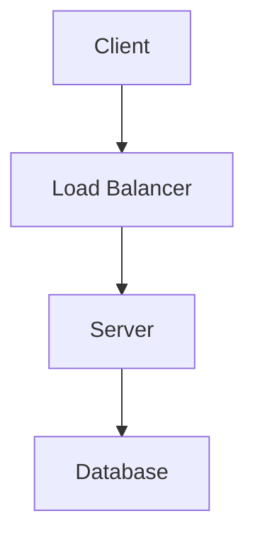
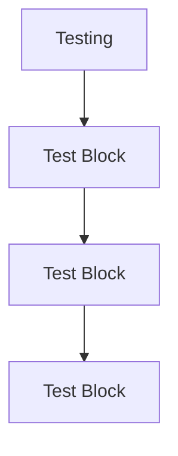

```dart
echo "testing"
ls

```


```mermaid
%%{init: { 'theme': 'dark' } }%%
graph TD
    %% Config %%
    classDef default fill:#282828,stroke:#F6BE00;
    
    %% Nodes %%
    Component(Component)
    Misc(&quot;
        TimerComponent
        ParticleComponent
        SpriteBatchComponent
    &quot;)
    Effects(&quot;Effects&lt;br/&gt;(See the effects section)&quot;)
    Game(Game)
    FlameGame(FlameGame)
    PositionComponent(PositionComponent)
   
    Sprites(&quot;
        SpriteComponent
        SpriteGroupComponent 
        SpriteAnimationComponent
        SpriteAnimationGroupComponent
        ParallaxComponent 
        IsoMetricTileMapComponent
    &quot;)
    
    HudMarginComponent(HudMarginComponent)
    HudComponents(&quot;
        HudButtonComponent
        JoystickComponent
    &quot;)
    
    OtherPositionComponents(&quot;
        ButtonComponent
        CustomPainterComponent
        ShapeComponent
        SpriteButtonComponent
        TextComponent
        TextBoxComponent
        NineTileBoxComponent
    &quot;)
        
    %% Flow %%
    Component --&gt; Misc
    Component --&gt; Effects
    Component --&gt; PositionComponent
    Component --&gt; FlameGame
   
    Game --&gt; FlameGame
    PositionComponent --&gt; Sprites
    PositionComponent --&gt; HudMarginComponent
    PositionComponent --&gt; OtherPositionComponents
    HudMarginComponent --&gt; HudComponents
```


This is the starting point for your brand new documentation site, powered by the awesome `jaspr_content` package! Jaspr Content makes it easy to create beautiful and functional documentation. You can learn more about its features by visiting the [official documentation]({{links.docs}}).

## Getting Started

Here are a few things you can do to begin:

*   Explore the features of `jaspr_content` inside `lib/main.dart`.
*   Read the [Quick Start Guide]({{links.quickstart}}) to understand how to set up your your content-driven site.
*   Start adding your own content pages in the `content/` directory.

## Showcase

`jaspr_content` supports all standard markdown syntax, allowing you to format your content effectively. It also supports adding custom components like this one:

<Info>
  This is an example of a custom component. You can create your own or use the ones provided by `jaspr_content` to enhance your documentation!

  <Clicker/>
</Info>

### Inline Elements

Use `inline code` for brief mentions of code, **bold text** for emphasis, or *italic text* for highlighting. You can also create [links to external sites]({{links.website}}).

### Blockquotes

> This is a blockquote. It's great for highlighting important information or quotes.
> It has a custom color applied to it using `jaspr_content`s theming capabilities.

### Code Blocks

You can easily include code snippets. `jaspr_content` even comes with syntax highlighting and copy functionality out of the box.






```dart
// lib/main.dart
import 'package:jaspr/jaspr.dart';
import 'package:jaspr_content/jaspr_content.dart';

void main() {
  runApp(ContentApp(
    parsers: [
      MarkdownParser(),
    ],
  ));
}
```

## Images

Displaying images is straightforward:


You can even **zoom-in** by clicking on the image.

## More to Discover!

This is just a placeholder to get things started. 

Feel free to explore the [Documentation]({{links.docs}}) to understand the underlying architecture and how you can customize your site further.

